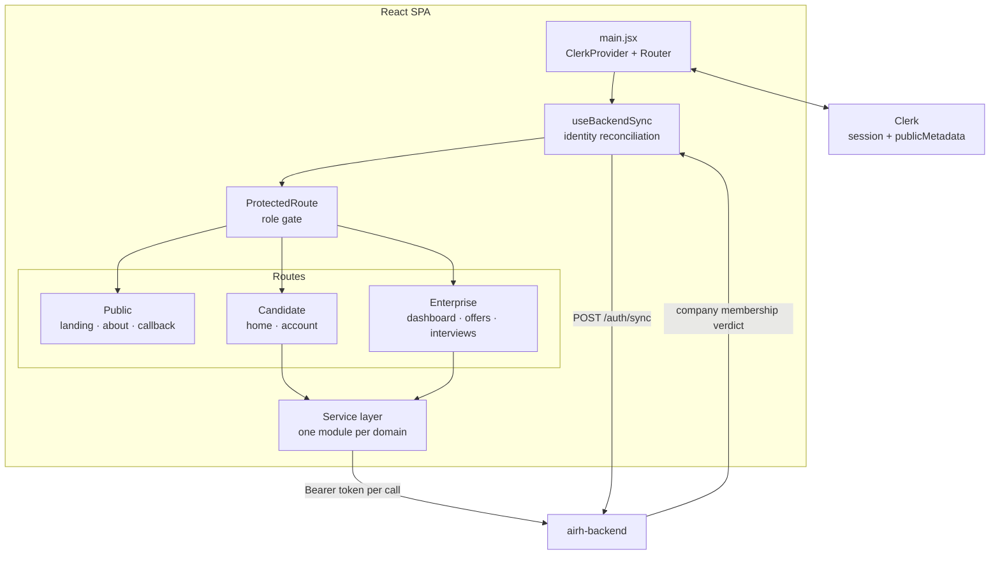

# AIRH Frontend

React client for an AI recruitment platform. One application serving two audiences with different data boundaries: candidates running AI interviews, and companies reading the results for their own postings.

`React 18` · `Vite` · `React Router` · `Clerk` · `Vercel`

---

## What it does

**Candidates** upload a CV, get it parsed and critiqued, browse job offers, run a simulated interview turn by turn, and read their scored feedback.

**Companies** post offers, see who interviewed against them, and open the full evaluation for each candidate.

Both live in one deployment, one Clerk instance, one routing tree. The role boundary is what makes that safe.

---

## Architecture



---

## Engineering decisions

### The client-side role check is UX, the server is the authority

`ProtectedRoute` reads `publicMetadata.profil` from the Clerk session and redirects on mismatch. That is worth doing, because sending a candidate to an enterprise dashboard is a bad experience.

It is not worth trusting. Client-side metadata is client-visible and the routing tree ships to the browser regardless.

So enterprise routes are gated on something else: the backend must confirm the user actually belongs to a company before those routes render at all. Until that verdict arrives, `syncDone` is false and the enterprise tree does not mount. A rejection flips `enterpriseRejected` and bounces the user out.

The API enforces the same boundary again on every request. The frontend guard prevents confusion; it is not what prevents access.

### Identity reconciliation handles the webhook race

Clerk creates the user. The backend needs its own row for that user before any authenticated call works. Those two events are not synchronous, and a user who signs up and immediately lands on the dashboard can arrive before their record exists.

`useBackendSync` retries `POST /auth/sync` up to six times at three-second intervals, so a slow webhook resolves itself instead of surfacing as a broken first session.

Returning users get a different path. A `localStorage` flag records that this user was synced before, which unblocks rendering immediately while the sync still runs in the background to refresh server state. Without it, every page reload of an already-known user would show a blank screen for the duration of a network round trip.

Optimistic for the known case, patient for the unknown one.

### Client-side integrity telemetry, treated as one signal among several

The interview view instruments paste events: how many, how many characters, and the ratio of pasted to typed content across the session. Those metrics ride along with each message to the backend.

This is client-controlled data and therefore not evidence on its own. Anyone who opens devtools can send whatever they like. It is useful precisely because the server does not depend on it: the interview service independently computes perplexity, burstiness, and stylometric consistency on the transcript itself.

Two independent signals, one cheap and spoofable, one server-side and not. They corroborate rather than substitute, and neither produces an automatic verdict.

### One service module per domain, token passed explicitly

`jobService`, `interviewService`, `resumeService`, `feedbackService`, `paymentService`, `contactService`. Each owns its endpoints and its error shape, and each receives the auth token as an argument rather than reading it from a module-level singleton.

Components fetch a fresh token from Clerk and pass it down. Nothing holds a stale token in module scope, and there is no global interceptor quietly attaching credentials to requests that should not carry them.

### Async state is rendered, not hidden

Skeleton loaders stand in for content shape during fetches rather than a spinner over an empty page, pagination keeps offer lists bounded, and client-side fuzzy search over the already-loaded set avoids a round trip per keystroke.

---

## Routes

| Path | Access | Purpose |
|---|---|---|
| `/` | Public | Candidate landing |
| `/enterprise` | Public | Company landing |
| `/about` | Public | About |
| `/auth/callback` | Public | Post-authentication redirect |
| `/home` | Candidate | Dashboard: CV, offers, interview, feedback, subscription |
| `/account` | Candidate | Account and data deletion |
| `/enterprise/dashboard` | Enterprise, backend-verified | Offers overview |
| `/enterprise/offers/:offerId` | Enterprise, backend-verified | Offer detail and candidate list |
| `/enterprise/interviews/:feedbackId` | Enterprise, backend-verified | Full evaluation |

Deployed on Vercel with SPA rewrites so deep links resolve to the client router.

---

## Layout

```
src/main.jsx                  ClerkProvider, router, route definitions
src/hooks/useBackendSync.js   Identity reconciliation and enterprise verification
src/components/ProtectedRoute.jsx  Role gate
src/services/                 One API module per domain
src/components/landing/       Marketing surface
src/components/tabs/          Candidate dashboard tabs
src/components/tabs/enterprise/  Company dashboard tabs
src/components/dashboard/     Shared dashboard chrome
src/components/ui/            Pagination, skeleton loaders
src/page/                     Route-level pages
```

---

## Running it

```bash
npm install
cp .env.example .env.local     # VITE_API_BASE_URL, VITE_CLERK_PUBLISHABLE_KEY
npm run dev                    # http://localhost:5173
```

```bash
npm run build
npm run lint
```

Only `VITE_`-prefixed variables reach the browser bundle. Nothing else belongs in this repository's environment.

---

## Related repositories

| Repo | Role |
|---|---|
| `airh-backend` | Orchestration API: identity, billing, credits, persistence |
| `cv_agent_api` | Multi-agent CV extraction and analysis |
| `interview_agent_api` | Stateful interview simulation engine |

---

## Known limitations

- **No test suite and no CI.** Contract tests on the service layer and a smoke test on the role gate come first.
- **Styling is per-component CSS files** with no shared token layer, so visual consistency is maintained by convention rather than enforced.
- **Enterprise routes render nothing while verification is pending.** Candidates get an optimistic path; enterprise users should get a loading state rather than a blank frame.
- **Several unused dependencies** remain in `package.json` from an earlier direction and should be removed.
